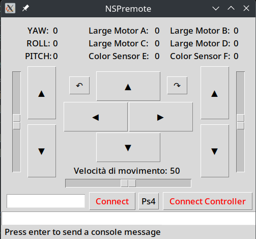

# Nspremote

  

This repository is still under (slow) active development; this is my first public repository meant to be used by someone else, so please be patient, the code is buggy and made off mixed Italian and English comment, for any problem or info don't esitate to contact me or my team at **nevegome@gmail.com**.
## The project
This repository represent my development of a spike 2 controll app, the app is forked on [Spremote  library for spike 3 comunication](https://github.com/jeflem/spremote) by **jeflem** , the library has been majorly rewritten to controll a spike 2 Robot built by [Gome Neve robotics team](https://sites.google.com/scuolaladina.com/gome-neve/) to compete in FIRST Lego League.
The desktop app is written in python using the Tkinter framework for the graphical interface, while the Nspremote and serial library (once finished will become a separate repository) are used to handle the Computer-Brick bluetooth comunication (wired connection is also avaible)
## Usage
The App requires python (aggiungere versione) and the serial library, moreover Gamepad controll is supported through the Gamepad library (only dualshock 4 has been tested), eventough compatibility should be avaible for Linux, Windows and Mac; at the moment the App is working only on Linux, Windows should work by matching the serial port and Mac has not been tested at the moment.
The working App gui is contained in the gui.py file.that can be run from visual studio code or by running python gui.py after connecting the spike brick, to identify the serial port the command: 
`sudo dmesg | grep rfcomm` for bluetooth connection
`sudo dmesg | grep tty` for wired connection
[more info here](https://libdoc.fh-zwickau.de/opus4/frontdoor/deliver/index/docId/15400/file/lego_spike_linux.pdf)
Once turned on the brick and connected wait some time otherwise it might freeze (working on it)
Motors *A* and *B* are used as movement motors, this can be changed in gui.py file right at the begin, the same for arms motors.

## TODO:
- [ ] Add telemetry reading (currently this freezes the brick)
- [ ] Rewrite the readme, create a documentation for nspremote
- [ ] (probabilmente dovrei contattare jeflem)
- [ ] Add pad reconnection
- [ ] reorganize layout with frames
- [ ] Find a way to document the id reading in spike2 (i had to discover it by myself (print(hub.port.A.info()['type']))
- [ ] [Add all of the id's](https://github.com/pybricks/technical-info/blob/master/assigned-numbers.md)
